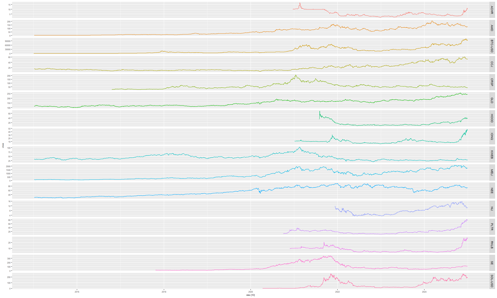
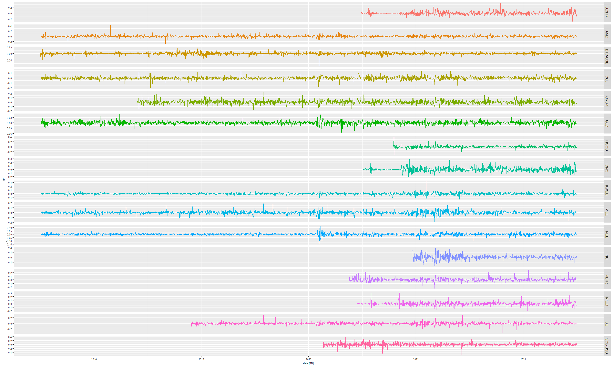

```{r setup, include=FALSE}
knitr::opts_chunk$set(echo = FALSE, message = FALSE, warning = FALSE)

#Preparation
knitr::opts_chunk$set(
  echo = TRUE, message = FALSE, warning = FALSE, cache = FALSE,
  dev.args = list(pointsize = 11), fig.height=3.5, fig.width=7, fig.align='center'
)
options(digits = 3, width = 60)

rm(list=ls())

lapply(names(sessionInfo()$otherPkgs), function(pkgs)
  detach(
    paste0('package:', pkgs),
    character.only = T,
    unload = T,
    force = T
  ))

library(tidyverse)
library(fpp3)
library(tidyquant)
library(sandwich)
library(lmtest)
library(GGally)
library(kableExtra)

#define stocks
stock <- tidyquant::tq_get(c("BTC-USD", "HOOD", "AMD",  "PLTR", "RKLB",
                             "IONQ",    "ACHR", "NU",   "SE",   "KWEB",
                             "GLD",     "CCJ",  "CRSP", "NEE",  "MELI", "SOL-USD"), 
                           get = "stock.prices" ,from="2015-01-01", to="2024-12-31") %>% 
  mutate(date = as_date(date)) %>% 
  as_tsibble(index = date,key = symbol) %>% 
  group_by_key() %>% 
  mutate(rtn = difference(log(close))) %>% #this is the log return computed
  filter(!is.na(rtn)) %>% 
  group_by_key() %>% 
  mutate(trading_day = row_number()) 

stock %>% select(symbol,date,close,rtn)
```

# Part I – Time Series Dynamics, Returns and Stylized Facts

## (a) Dynamics of Financial Time Series

This study uses daily closing prices of three individual stocks (e.g. "BTC-USD", "HOOD", "AMD", "PLTR", "RKLB", "IONQ", "ACHR", "NU", "SE", "KWEB", "GLD", "CCJ", "CRSP", "NEE", "MELI", "SOL-USD") from January 2015 to December 2024, obtained from Yahoo Finance (finance.yahoo.com). The dataset is cleaned to exclude non-trading days and adjusted for dividends and stock splits. Visual inspection of price dynamics reveals long‑term upward trends interrupted by sharp drops and high‑volatility episodes. Elevated volatility is observed during: Global market stress (e.g., 2020 pandemic crash, 2022–2023 monetary tightening cycles) Major macroeconomic announcements (inflation, Fed policy, GDP releases) Company earnings releases and sector news shocks Geopolitical tensions and liquidity events Key events driving price behavior include central bank rate decisions, quarterly earnings, fiscal stimulus, and sector regulatory changes.

## 1(b) Price Time Series Plot

### Time series

```{r, echo=FALSE, out.width="100%"}

```

### Log returns

```{r, echo=FALSE, out.width="100%"}

```

### mean

```{r table_mean, echo=FALSE}
stock %>%
  features(rtn, list(mean = ~mean(., na.rm=TRUE), 
                     n = ~length(.))) %>%
  kbl(booktabs = TRUE)
```


### standard deviation
```{r table_sd, echo=FALSE}
stock %>%
  features(rtn, list(sd = ~sd(., na.rm=TRUE), 
                     n = ~length(.))) %>%
  kbl(booktabs = TRUE)
```

### skew
```{r table_skew, echo=FALSE}
stock %>%
  features(rtn,list(skew =  timeSeries::colSkewness, 
                    n = ~length(.))) %>% 
  mutate(skew_stat =  sqrt(n)*skew/sqrt(6), 
         p_val_skew_stat = 2*(1-pnorm(abs(skew_stat)))) %>% 
  kbl(booktabs = TRUE)
```
### kurt
```{r table_kurt, echo=FALSE}
stock %>%
  features(rtn,list(kurt =  timeSeries::colKurtosis, 
                    n = ~length(.))) %>% 
  mutate(kurt = kurt+3,
         kurt_stat =  sqrt(n)*kurt/sqrt(24), 
         p_val_kurt_stat = 2*(1-pnorm(abs(kurt_stat)))) %>% 
  kbl(booktabs = TRUE)
```
## 1(c)
